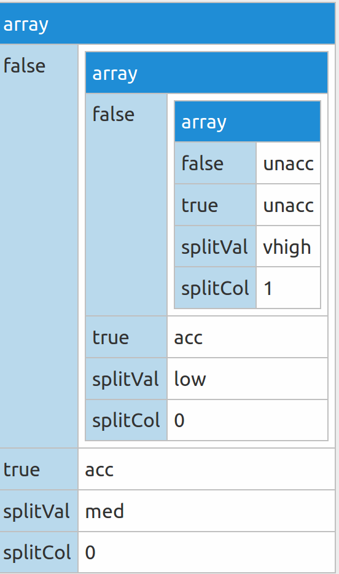

# Decision Tree
**Shah Zafrani - CS 7625 Big Data (Dr. Kang) - Fall 2018 ** 

### Overview

For this exercise the objective was to use create a decision tree using by using either GINI index, Information Gain, or misclassification errors. I chose to you Information Gain based on Entropy. 

My Entropy logic is shown below:

```python
def entropy(dataSplit): # dataSplit is formatted as an array of counts: [5,9]
    total = sum(dataSplit)
    numClasses = len(dataSplit)
    entropy = 0
    for d in dataSplit:
        prob = float(d) / total
        entropy += -1 * (prob * math.log(prob, 2))
    return entropy
```

And Information Gain is calculated by subtracting the entropy of splitting on a feature value from the current entropy. 

My algorithm was a particularly inefficient one, as I calculate the information gain of splitting on each feature, and then choose the value with the lowest entropy from that feature. I also use a `MAX_DEPTH` hyper-parameter so I can avoid both stack-overflows and overfitting. Once the maximum depth is reached, a leaf node will be created based on which class has the most presence in the remaining data.

```python
def guessFromMajority(data):
    uniqClasses = data[:,-1]
    bestClass = ""
    highestCount = 0
    for u in uniqClasses:
        uCount = sum(data[:,-1]==u)
        if uCount >= highestCount:
            bestClass = u
            highestCount = uCount
    return bestClass
```

My tree was designed as a python dictionary as opposed to using a library or creating a class. Here is the dictionary displayed as a json:

```json
{
    "splitVal": "low", // Value to split on
    "true": "acc", // branch for matching values (it's a leaf in this case)
    "false": // branch for non-matching values 
    {
        "splitVal": "med",
        "true": "acc",
        "false":
        {
            "splitVal": "vhigh",
            "true": "unacc",
            "false": "unacc",
            "splitCol": 1
        },
        "splitCol": 0
    },
    "splitCol": 0 // feature column to split on
}
```


### Results

| **Max Depth**  | 1 | 2 | 3 | 50 |
| ---------- | ---- | ---- | ---- | ---- |
| **Accuracy** | 100% | 100% | 84% | 84% |

The results show that Overfitting can be a big problem with this dataset. If my tree goes more than 2 layers deep from the root node, then I start to see diminishing accuracy.



### Resources:
  - http://saedsayad.com/decision_tree.htm
     - Used for help understanding entropy split and information gain
  - http://www.learnbymarketing.com/481/decision-tree-flavors-gini-info-gain/
     - Used for understanding the difference between using gini-index and using entropy
- https://jsonvisualizer.com/
     - Used for visualizing decision tree (the image shown above)