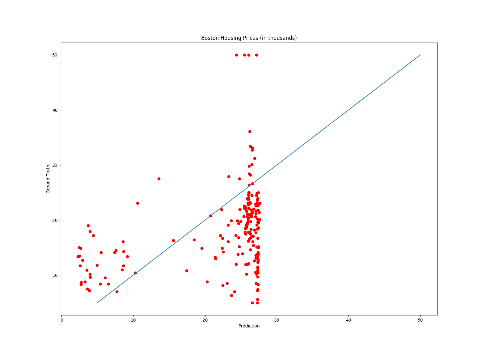
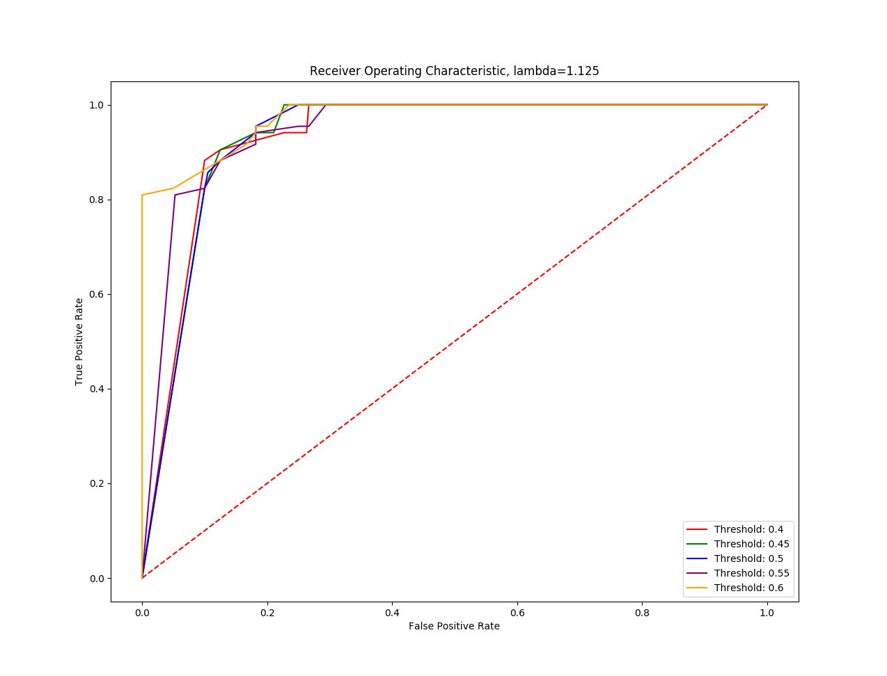

# Big Data Analytics Homework 2

**Shah Zafrani - Fall 2018 **

## Boston Housing Prices

I created a linear model for predicting housing prices in Boston based on 13 features. I found that using Gradient Descent performed better than using standard linear regression. The Linear Regression achieved an RMSE of 20.41 and the Gradient Descent achieved an RMSE of 10.06. 

Here are the linear regression weights: [ 1.30811427e+00  1.57839537e-02  2.87648760e-02  4.85005795e-01
 -1.44986948e+01  8.47892453e+00 -4.33843034e-02 -1.19833961e+00
  1.93035110e-01 -1.58809318e-02 -7.75604208e-01  1.19883846e-02
 -1.44657375e-01]

and here are the gradient descent weights: [

-8.79992027e-05 | 1.69187419e-02 | -3.06910358e-03  | 6.74654900e-05 |
  4.67411658e-05  | 2.31244698e-03 | -3.92945521e-03  | 8.47468638e-04 |
  8.32626056e-04  | 4.11414176e-03   | 8.63125027e-04 | 6.33426922e-02 |
 -6.40253953e-03]

Here's the heatmap of the predictions: 

## MNIST Classification

When given a dataset of 5s and 6s 15x15 pixels each, I used Ridge Regression to create a classifier. 

To optimize for the lambda value, I ran a loop checking values ranging from 0.75 to 1.25, and settled on 1.125 as my optimal lambda value. For thresholds, I checked 5 different values between 0.4 and 0.6. I used the RMSE of my training data as the bias for my model. 

TPRS and FPRS: 

lambda= 1.125, Threshold of 0.4: avg(TPR, FPR)
​	 0.9669467787114847, 0.2763214455822815
lambda= 1.125, Threshold of 0.45: avg(TPR, FPR)
​	 0.9610644257703083, 0.23380938462981807
lambda= 1.125, Threshold of 0.5: avg(TPR, FPR)
​	 0.9458747135217724, 0.21873761429488986
lambda= 1.125, Threshold of 0.55: avg(TPR, FPR)
​	 0.9282340208810798, 0.20722445640015302
lambda= 1.125, Threshold of 0.6: avg(TPR, FPR)
​	 0.9282340208810798, 0.1760789455642397

